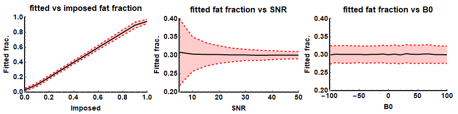
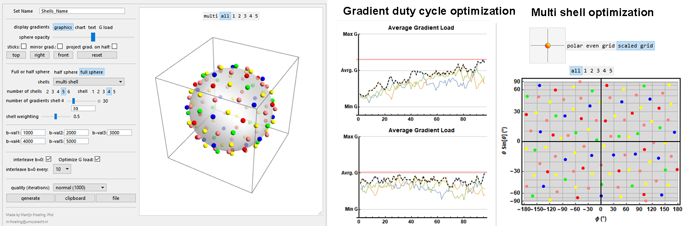
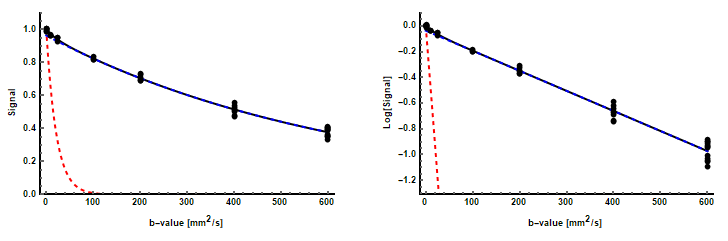
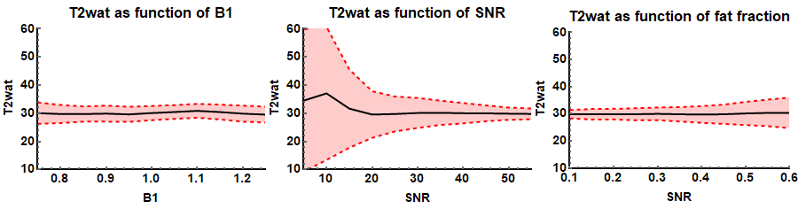
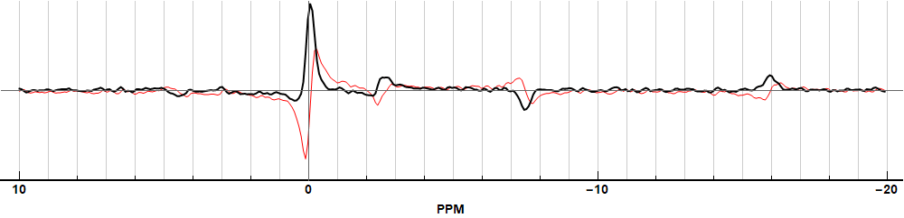
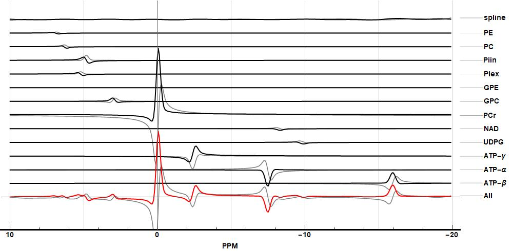
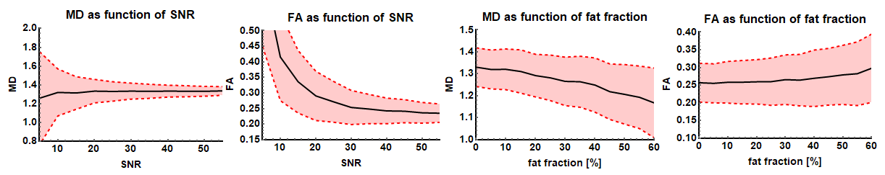

---

permalink: /Toolboxes_discription/
title: "Discription of toolboxes"

sidebar:
  nav: "Toolboxes"
  
toc: true

---

## CardiacTools

A collection of tools to analyze cardiac data. The main features are
cardiac shape analysis which allows defining the hard in a local
myocardial coordinate system which allows quantifying and analyzing
data. When the cardiac geometry is known there are functions to analyze
qMRI parameters in the AH17 model (Cerqueira et al. 2002) or perform
transmural sampling of qMRI parameters. Most of the functionality is
demonstrated in the `demo.nb`.

## CoilTools

A collection of tools to evaluate complex multi-coil data. The functions
are specific for analysis of multi-coil magnitude and noise data which
allows quantifying per channel SNR. Furthermore, if complex coil
sensitivity maps are available it allows performing SENSE g-factor maps
simulations.  
This toolbox is not demonstrated in the `demo.nb`.

## DenoiseTools

The toobox provides two algorithms that allow denoising of DWI data. The
first is based on and LMMSE framework (Aja-Fernandez et al. 2008) and
the second is based on a random matrix theory and Principal component
analysis framework (Veraart, Fieremans, and Novikov 2016; Veraart et al.
2016). Furthermore, it provides an anisotropic filter for denoising the
estimated diffusion tensor which provides more reliable fiber
orientation analysis (Lee, Chung, and Alexander 2006). Most of the
functionality is demonstrated in the `demo.nb`.

## DixonTools

An IDEAL based Dixon reconstruction algorithm (Reeder et al. 2005; Yu et
al. 2008). The method provides multi-peak fitting B0 field and T2-
correction. The toolbox also provides a function for unwrapping phase
data in 2D and 3D based on a best path method (Abdul-Rahman et al. 2007;
Herraez et al. 2002). It also contains a function that allows simulating
gradient echo Dixon data. Most of the functionality is demonstrated in
the `demo.nb`.

## ElastixTools

A wrapper that calls the Elastix registration framework (Klein et al.
2010; Shamonin 2013). The toolbox determines what registration or
transformations need to be performed, exports the related data to a temp
folder and calls an automatically generated command line script that
performs the registration. After registration is completed the data is
again loaded into Mathematica. Most of the functionality is demonstrated
in the `demo.nb`.

## GeneralTools

This toolbox provides core functions used in many other functions and
features. The functions comprise amongst others: data cropping,
mathematical and statistical operators that ignore zero values, and data
rescaling, transformation and padding. Most of the functionality is
demonstrated in the `demo.nb`.

## GradientTools

The main feature is an algorithm that uses static repulsion (Jones,
Horsfield, and Simmons 1999; Froeling et al. 2017) to generate
homogeneously distributed gradient directions for DWI experiments. It
also provides functions to convert bval and bvec files to bmatrix and
vice versa. Most of the functionality is demonstrated in the `demo.nb`.

## ImportTools

Allows importing DCM data or DCM header attributes. These functions are
rarely used since the toolbox mostly uses the NIfTY data format and
provides tools to convert DCM to NIfTI via
[dcm2niix](https://github.com/rordenlab/dcm2niix). This toolbox is not
demonstrated in the `demo.nb`.

## IVIMTools

The toolbox includes functions to perform IVIM fitting of DWI data.
There are two main functions: non linear fitting and Bayesian fitting
(Orton et al. 2014). Some of the functionality is demonstrated in the
`demo.nb`.

## JcouplingTools

A toolbox that allows simulation of NMR spectra using Hamiltonians based
on methods from [FID-A](https://github.com/CIC-methods/FID-A). It allows
simulating large spin systems (Castillo, Patiny, and Wist 2011) and was
mainly implemented to investigate fat spectra in TSE (Stokes et al.
2013). Most of the functionality is demonstrated in the `demo.nb`.

## MaskingTools

Tools for masking and homogenization of data. It provides functions for
smoothing cutting and merging masks and functions for the evaluation of
data within masks. Most of the functionality is demonstrated in the
`demo.nb`.

## NiftiTools

Import and export of the NIfTI file format. Part of the code is based on
previously implemented
[nii-converter](https://github.com/tomdelahaije/nifti-converter). For
converting DICOM data to the NIfTI file format the toolbox uses
[dcm2niix](https://github.com/rordenlab/dcm2niix/releases). It also
provides some specialized NIfTI import functions for specific
experiments which are probably not generalizable. Most of the
functionality is demonstrated in the `demo.nb`.

## PhysiologyTools

Functions for importing and analyzing Philips physiology logging and
RespirAct trace files. The functions are rarely used and not well
supported. This toolbox is not demonstrated in the `demo.nb`.

## PlottingTools

A variety of functions for visualization of various data types. The main
functions are ‘PlotData’ and ‘PlotData3D’ which allow viewing 2D, 3D and
4D data. Most of the functionality is demonstrated in the `demo.nb`.

## Reconstruction Tools

A variety of function for raw MRI data reconstruction. The main goal was to 
create a set of functions that allow for the reconstruction of multi coil 3D CSI 
data and and low SNR 31P imaging data. For this toolbox there is no demo.  

## ProcessingTools

The toolbox comprises a variety of functions that allow data
manipulation and analysis. The main functions allow joining multiple
data sets into one continuous data set (Froeling et al. 2015) or to
split data of two legs into two separate data-sets. Furthermore, it
contains a collection of functions for data evaluation and analysis.
Most of the functionality is demonstrated in the `demo.nb`.

## RelaxometryTools

A collection of tools to fit T2, T2\*, T1rho and T1 relaxometry data.
The main function of this toolbox is an extended phase graph (EPG)
(Weigel 2015) method for multi-compartment T2 fitting of multi-echo spin
echo data (Marty et al. 2016). Therefore it provides functions to
simulate and evaluate EPG. Some of the functionality is demonstrated in
the `demo.nb`.

## SimulationTools

The main purpose of this toolbox is to simulate DTI based DWI data and
contains some functions to easily perform analysis of the fit results of
the simulated signals (Froeling et al. 2013). Some of the functionality
is demonstrated in the `demo.nb`.

## SpectroTools

The main purpose of this toolbox is to process and visualize spectra data
and allows to fit spectra using simulated basis spectra. Some of the functionality
is demonstrated in the `demo.nb`. Dynamic spectra and chemical shift data can be denoised
using PCA based de-noising (Froeling et al. 2020). 

## TensorTools

The original toolbox where the project started. The main functions in
this toolbox are to fit and evaluate the diffusion tensor model. Various
fitting methods are implemented (e.g. LLS, NLS, WLLS, and iWLLS). The
default method is an iterative weighted linear least squares approach
(Veraart et al. 2013). The tensor fitting also includes outlier
detections using REKINDLE (Tax et al. 2015) and data preparation
includes drift correction (Vos et al. 2017). Most of the functionality
is demonstrated in the `demo.nb`.

## TaggingTools
Currently under development

## VisteTools

Import and export functions for tensor data which can be used in the
[vIST/e](https://sourceforge.net/projects/viste/) tractography tool. None
of the functionality is demonstrated in the `demo.nb`.

## References

- Abdul-Rahman, Hussein S., Munther A. Gdeisat, David R. Burton, Michael
J. Lalor, Francis Lilley, and Christopher J. Moore. 2007. “Fast and
robust three-dimensional best path phase unwrapping algorithm.” *Applied
Optics* 46 (26): 6623. [link](https://doi.org/10.1364/AO.46.006623).

- Aja-Fernandez, Santiago, Marc Niethammer, Marek Kubicki, Martha E.
Shenton, and Carl Fredrik Westin. 2008. “Restoration of DWI data using a
rician LMMSE estimator.” *IEEE Transactions on Medical Imaging* 27 (10):
1389–1403. [link](https://doi.org/10.1109/TMI.2008.920609).

- Castillo, Andrés M., Luc Patiny, and Julien Wist. 2011. “Fast and
accurate algorithm for the simulation of NMR spectra of large spin
systems.” *Journal of Magnetic Resonance* 209 (2). Academic Press:
123–30. [link](https://doi.org/10.1016/j.jmr.2010.12.008).

- Cerqueira, Manuel D., Neil J. Weissman, Vasken Dilsizian, Alice K.
Jacobs, Sanjiv Kaul, Warren K. Laskey, Dudley J. Pennell, John A.
Rumberger, Thomas Ryan, and Mario S. Verani. 2002. “Standardized
myocardial sementation and nomenclature for tomographic imaging of the
heart: A Statement for Healthcare Professionals from the Cardiac Imaging
Committee of the Council on Clinical Cardiology of the American Heart
Association.” *Circulation* 105 (4). Lippincott Williams & Wilkins:
539–42. [link](https://doi.org/10.1161/hc0402.102975).

- Froeling, Martijn, Aart J. Nederveen, Dennis F. R. Heijtel, Arno
Lataster, Clemens Bos, Klaas Nicolay, Mario Maas, Maarten R. Drost, and
Gustav J. Strijkers. 2012. “Diffusion-tensor MRI reveals the complex
muscle architecture of the human forearm.” *Journal of Magnetic
Resonance Imaging* 36 (1). Wiley Subscription Services, Inc., A Wiley
Company: 237–48. [link](https://doi.org/10.1002/jmri.23608).

- Froeling, Martijn, Aart J. Nederveen, Klaas Nicolay, and Gustav J.
Strijkers. 2013. “DTI of human skeletal muscle: The effects of diffusion
encoding parameters, signal-to-noise ratio and T2 on tensor indices and
fiber tracts.” *NMR in Biomedicine* 26 (11): 1339–52. [link](https://doi.org/10.1002/nbm.2959).

- Froeling, Martijn, Jos Oudeman, G. J. Gustav J. Strijkers, Mario Maas,
M. R. Maarten R. Drost, Klaas Nicolay, and Aart J. A. J. Nederveen. 2015. 
“Muscle Changes Detected with Diffusion-Tensor Imaging after
Long-Distance Running.” *Radiology* 274 (2): 548–62. [link](https://doi.org/10.1148/radiol.14140702).

- Froeling, Martijn, Chantal M. W. Tax, Sjoerd B. Vos, Peter R. Luijten,
and Alexander Leemans. 2017. “MASSIVE brain dataset: Multiple
acquisitions for standardization of structural imaging validation and
evaluation.” *Magnetic Resonance in Medicine* 77 (5). Milan: 1797–1809. [link](https://doi.org/10.1002/mrm.26259).

- Froeling, M., Prompers, J. J., Klomp, D. W. J., & van der Velden, T. A. 2021. 
"PCA denoising and Wiener deconvolution of 31P 3D CSI data to enhance effective SNR and improve point spread function." *Magnetic Resonance in Medicine* 85 (6) , [link](https://doi.org/10.1002/mrm.28654)

- Herraez, Miguel Arevallilo, David R. Burton, Michael J. Lalor, and
Munther A. Gdeisat. 2002. “Fast two-dimensional phase-unwrapping
algorithm based on sorting by reliability following a noncontinuous
path.” *Applied Optics* 41 (35): 7437. [link](https://doi.org/10.1364/AO.41.007437).

- Jones, D. K., M. A. Horsfield, and A. Simmons. 1999. “Optimal strategies
for measuring diffusion in anisotropic systems by magnetic resonance
imaging.” *Magnetic Resonance in Medicine* 42 (3). Division of Medical
Physics, University of Leicester, Leicester Royal Infirmary, Leicester
LE1 5WW, United Kingdom.: 515–25. [link](https://doi.org/10.1002/(SICI)1522-2594).

- Klein, Stefan, Marius Staring, Keelin Murphy, Max A. Viergever, and
Josien P. W. Pluim. 2010. “Elastix: A toolbox for intensity-based
medical image registration.” *IEEE Transactions on Medical Imaging* 29
(1): 196–205. [link](https://doi.org/10.1109/TMI.2009.2035616).

- Lee, Jee Eun, M. K. Chung, and A. L. Alexander. 2006. “Evaluation of
Anisotropic Filters for Diffusion Tensor Imaging.” In *3[link](sup)rd[link](/sup)
Ieee International Symposium on Biomedical Imaging*, 77–80. IEEE. [link](https://doi.org/10.1109/ISBI.2006.1624856).

- Marty, Benjamin, Pierre Yves Baudin, Harmen Reyngoudt, Noura Azzabou,
Ericky C. A. Araujo, Pierre G. Carlier, and Paulo L. de Sousa. 2016.
“Simultaneous muscle water T2and fat fraction mapping using transverse
relaxometry with stimulated echo compensation.” *NMR in Biomedicine* 29
(4): 431–43. [link](https://doi.org/10.1002/nbm.3459).

- Orton, Matthew R., David J. Collins, Dow-Mu Koh, and Martin O. Leach. 2014. 
“Improved intravoxel incoherent motion analysis of diffusion
weighted imaging by data driven Bayesian modeling.” *Magnetic Resonance
in Medicine* 71 (1): 411–20. [link](https://doi.org/10.1002/mrm.24649).

- Reeder, Scott B., Angel R. Pineda, Zhifei Wen, Ann Shimakawa, Huanzhou
Yu, Jean H. Brittain, Garry E. Gold, Christopher H. Beaulieu, and
Norbert T. Pelc. 2005. “Iterative decomposition of water and fat with
echo asymmetry and least-squares estimation (IDEAL): Application with
fast spin-echo imaging.” *Magnetic Resonance in Medicine* 54 (3):
636–44. [link](https://doi.org/10.1002/mrm.20624).

- Shamonin, Denis. 2013. “Fast parallel image registration on CPU and GPU
for diagnostic classification of Alzheimer’s disease.” *Frontiers in
Neuroinformatics* 7 (January): 50. [link](https://doi.org/10.3389/fninf.2013.00050).

- Stokes, Ashley M., Yesu Feng, Tanya Mitropoulos, and Warren S. Warren. 2013. 
“Enhanced refocusing of fat signals using optimized multipulse
echo sequences.” *Magnetic Resonance in Medicine* 69 (4).
Wiley-Blackwell: 1044–55. [link](https://doi.org/10.1002/mrm.24340).

- Tax, Chantal M.W., Willem M. Otte, Max A. Viergever, Rick M. Dijkhuizen,
and Alexander Leemans. 2015. “REKINDLE: Robust Extraction of Kurtosis
INDices with Linear Estimation.” *Magnetic Resonance in Medicine* 73
(2): 794–808. [link](https://doi.org/10.1002/mrm.25165).

- Veraart, Jelle, Els Fieremans, and Dmitry S. Novikov. 2016. “Diffusion
MRI noise mapping using random matrix theory.” *Magnetic Resonance in
Medicine* 76 (5): 1582–93. [link](https://doi.org/10.1002/mrm.26059).

- Veraart, Jelle, Dmitry S. Novikov, Daan Christiaens, Benjamin Ades-aron,
Jan Sijbers, and Els Fieremans. 2016. “Denoising of diffusion MRI using
random matrix theory.” *NeuroImage* 142 (November). Elsevier Inc.:
394–406. [link](https://doi.org/10.1016/j.neuroimage.2016.08.016).

- Veraart, Jelle, Jan Sijbers, Stefan Sunaert, Alexander Leemans, and Ben
Jeurissen. 2013. “Weighted linear least squares estimation of diffusion
MRI parameters: Strengths, limitations, and pitfalls.” *NeuroImage* 81
(November). Elsevier Inc.: 335–46. [link](https://doi.org/10.1016/j.neuroimage.2013.05.028).

- Vos, Sjoerd B., Chantal M. W. Tax, Peter R. Luijten, Sebastien Ourselin,
Alexander Leemans, and Martijn Froeling. 2017. “The importance of
correcting for signal drift in diffusion MRI.” *Magnetic Resonance in
Medicine* 77 (1): 285–99. [link](https://doi.org/10.1002/mrm.26124).

- Weigel, Matthias. 2015. “Extended phase graphs: Dephasing, RF pulses,
and echoes - pure and simple.” *Journal of Magnetic Resonance Imaging*
41 (2). Wiley-Blackwell: 266–95. [link](https://doi.org/10.1002/jmri.24619).

- Yu, Huanzhou, Ann Shimakawa, Charles A. McKenzie, Ethan Brodsky, Jean H.
Brittain, and Scott B. Reeder. 2008. “Multiecho water-fat separation and
simultaneous R\*2 estimation with multifrequency fat spectrum modeling.”
*Magnetic Resonance in Medicine* 60 (5): 1122–34. [link](https://doi.org/10.1002/mrm.21737).
