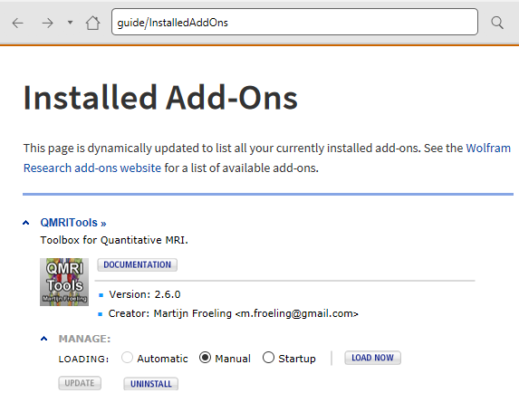

---

permalink: /doc/
title: "Documentation and installation"

sidebar:
  nav: "documentation"

---

Documentation of all functions and their options is fully integrated in
the Mathematica documentation. The toolbox always works within the latest version of 
Mathematica and does not support any backward
compatibility. After the toolbox is installed correctly it should show
up as a package in the Mathematica add-ons.

